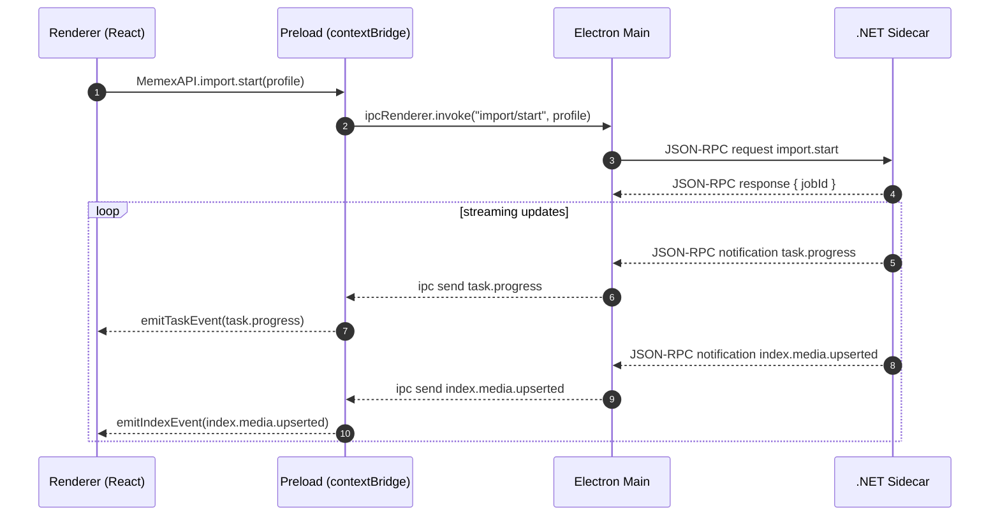
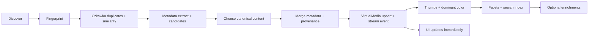

# A Reusable Playbook for LLM-Assisted Dry Specs

## Executive summary

The Memex spec creation process worked because it treated the spec as a **durable contract** rather than a snapshot of implementation. The team repeatedly anchored on **invariants-first**, expressed behavior at boundaries as **contracts** (events, IPC, DB semantics), enforced **testability-first** with **E2E-by-design**, and implemented in **vertical slices** that always produced a user-visible end-to-end outcome. This combination let the spec stay stable while implementation details evolved, enabling milestones to reference stable section anchors without becoming “outdated.”  

This report turns that experience into a reusable, interactive spec-writing toolkit for small, self-directed dev teams co-authoring dry specs with an LLM. It includes a repeatable process (roles, prompts, artifacts), copy-paste templates (spec skeleton, ADR-lite, event contracts, DB/IPC sketches, acceptance criteria, Playwright dialog stubs), governance rules (MUST/SHOULD/MAY, versioning, milestone mapping), and practical code snippets for NDJSON-framed JSON-RPC over stdin/stdout, Playwright Electron harnesses, and SQLite DDL. It also includes guidance for making specs **AI/LLM-ready** via instrumentation and queryable state (without implementing AI features in v1).  

Primary sources referenced include Electron security and IPC guidance (context isolation, preload scripts), Playwright Electron automation + locator and fixture best practices, JSON-RPC 2.0 requirements, .NET cooperative cancellation and robust process I/O, and SQLite WAL/FTS5 documentation. citeturn0search0turn0search4turn0search20turn0search9turn0search1turn2search10turn2search12turn3search3turn0search2turn1search1turn1search0turn3search0turn3search1

## The Memex-derived principles that make specs long-lived

A “dry spec” stays valuable across refactors and pivots because it’s written around **truths that remain true** even as implementation changes. Memex’s iteration implicitly followed these principles; this section names them so you can reuse them.

### Invariants-first beats feature-first

Start by writing *the few rules you will not break*, including safety constraints, UX constraints, and operational constraints. In Memex, examples were: “non-destructive by default,” “streaming results,” and “cancel/restart/rerun always possible.” That forced architecture, UI, and data model to align without over-specifying internal code shape.

A good invariant has three properties:

- It is observable (you can test it).
- It is stable (unlikely to change across versions).
- It constrains design (it forces useful decisions).

### Contract-driven design turns architecture into a boundary agreement

Memex became milestone-friendly because the spec didn’t say “use library X”; it said “these components exchange messages shaped like Y and must provide behavior Z.” That’s contract-driven design:

- **Event contract**: what progress and state-change events exist; what fields they contain; what ordering/monotonicity is guaranteed.
- **IPC contract**: request/response schema, error schema, framing rules.
- **Data model contract**: the meaning of “Asset,” “DuplicateGroup,” “VirtualMedia,” “Provenance,” “Job,” etc.
- **UX contract**: when results appear, what panels show job state, how cancellation works.

This style survives large rewrites because contracts can remain stable even if internal modules change.

JSON-RPC is a good example of a durable contract: it standardizes request/response correlation, notifications, and error envelopes. If you choose it, you inherit a well-defined structure: responses must include the same `id` as the request, and notifications omit the `id`. citeturn0search2turn0search30turn2search2turn2search9

### Testability-first is an architecture requirement, not a QA phase

Memex succeeded after switching to Electron because the spec elevated automated interactive E2E to a **hard requirement** and then designed around it: OS dialogs must be stubbed, the app must support test-mode injection, and test runs must be isolated from real user data.

Electron’s security model reinforces the same separation: renderers should be isolated and privileged APIs exposed via preload scripts only. That architectural separation makes it much easier to introduce test doubles at boundaries. citeturn0search0turn0search4turn0search16

### E2E-first vertical slices keep a self-directed team aligned

A small team stays “self-going” when each milestone ends with:

- a visible UI outcome,
- a stable contract surface,
- and an E2E test that proves it.

Playwright’s Electron automation capability makes this practical: you can launch the app via `_electron.launch()`, obtain the first window, and drive real UI interactions. citeturn0search5turn0search1turn0search9

### Bonus principle: write specs as numbered anchors, patch them, don’t reorder them

Milestones referencing a spec only works if anchors remain stable. That means:

- stable section numbering (or stable headings with IDs),
- changes via “patches/diffs” rather than rewrites,
- ADR-lite entries for big pivots.

## Repeatable interactive process for LLM-assisted dry spec creation

This is a step-by-step process you can run on any new project. It assumes a small (2–6 person) team using an LLM as a co-author and editor.

### Roles and responsibilities

A lean team can cover these roles (one person may cover multiple):

- **Facilitator / Spec Editor**: owns coherence, ensures invariants-first, controls anchor stability, accepts patches.
- **Domain Owner**: provides ground truth about user workflows and constraints.
- **Architect / Contracts Owner**: owns IPC/event contracts, data model semantics, module boundaries.
- **Test Lead**: owns E2E requirements, stubbing strategy, Given/When/Then acceptance criteria.
- **Implementation Lead**: validates that requirements are implementable; identifies risky assumptions early.
- **LLM Operator (can be the Editor)**: runs prompt sequences, requests diffs, keeps outputs in spec format.

### Core artifacts

Each spec session produces or updates concrete repo artifacts:

- `spec/00-invariants.md` (the invariant ledger)
- `spec/10-functional.md` (dry requirements)
- `spec/20-contracts.md` (event + IPC + schema meaning)
- `spec/30-ux-flows.md` (flows + panes + streaming UX rules)
- `spec/40-testing.md` (E2E harness rules + stubs)
- `spec/50-milestones.md` (milestone mapping matrix)
- `spec/adr/ADR-XXXX-*.md` (ADR-lite decisions)

You can keep a single monolithic spec too, but separating files improves patchability and avoids reorder churn.

### A repeatable phased workflow

The table below is the “LLM-assisted spec loop” you can reuse.

| Phase | Human inputs | LLM outputs | Primary objective |
|---|---|---|---|
| Constraint capture | project goals, must-not-break rules, target stacks | Invariant ledger + glossary | lock down the few truths that must remain true |
| Dry requirements | user stories, workflows, constraints | functional requirements written as outcomes + acceptance test hooks | separate “what must be true” from “how we do it” |
| Contract drafting | system boundaries, processes, persistence needs | event schema + IPC schema + DB semantic model | make architecture replaceable; define stable interfaces |
| UX flows | workflows, panes, progressive disclosure | flows + UI state model + “what streams when” rules | ensure UI matches streaming/cancel semantics |
| Test-first design | E2E needs, what OS actions exist | stubbing plan + harness pattern + acceptance criteria | ensure the system is automatable by design |
| Milestone mapping | desired release sequence | milestone matrix mapping sections→tests→artifacts | make the spec directly plannable and executable |
| ADR capture | major decisions/pivots | ADR-lite entries | preserve rationale without rewriting the spec |

### Mermaid: IPC and streaming in a contract-driven Electron app



This mirrors Electron’s recommended pattern: privileged APIs exposed through preload, renderer isolated, and explicit IPC channels. citeturn0search4turn0search16turn0search20

### Session timeboxes and outputs

A practical cadence for a small team:

- **60–90 min session**: one phase only (e.g., invariants + glossary, or event contract + IPC schema).
- Output per session: **one merged patch** to the spec + **one testable acceptance criterion**.
- Rule: every session ends with “what changed” and “what didn’t change.”

## Templates and copy-paste schemas

This section is the toolkit: you can drop these into a repo and fill them in.

### Fillable spec skeleton (Markdown)

```markdown
# <Project Name> — Dry Specification (vX.Y)

## Executive summary
- Problem:
- Outcomes:
- Non-goals:
- Guarantees (top invariants):

## Glossary
- Asset:
- Canonical:
- Virtual item:
- Job:
- Provenance:
- ...

## Invariants (MUST)
### Safety & data integrity
- MUST:
- MUST NOT:

### UX invariants
- MUST:
- SHOULD:

### Operational invariants
- MUST be cancelable:
- MUST be restartable:
- MUST stream results:

## Functional requirements
### Import and indexing
- FR-IMPORT-001 ...
  - Acceptance (Given/When/Then):

### Deduplication & similarity
- FR-DEDUP-001 ...

### Metadata extraction and merge
- FR-META-001 ...

### Library views
- FR-UI-001 ...

### Inspector & provenance
- FR-PROV-001 ...

## Contracts
### Event contract
- Event types:
- Envelope schema:
- Ordering guarantees:
- Error/warning payload format:

### IPC (JSON-RPC)
- Transport:
- Framing:
- Methods:
- Errors:
- Versioning:

### Data model semantics
- Tables and invariants:
- Indexing strategy:
- Migration policy:

## UI/UX flows
- Primary flows:
- Panes/layout:
- Streaming update rules:
- Error states:
- Accessibility/testing locators approach:

## Testability requirements
- E2E is a hard requirement:
- OS dialog stubs:
- Test data isolation:
- Fixture strategy:
- “One vertical slice per milestone” rule:

## Milestone mapping
- Matrix mapping spec anchors → milestone → tests → demo criteria

## Future extensions
- AI assistant:
- Export:
- Cloud sync:
- ...
```

### ADR-lite template

Use ADR-lite to capture pivots (e.g., shell swaps) without rewriting the spec.

```markdown
# ADR-<YYYYMMDD>-<short-title>

## Status
Proposed | Accepted | Deprecated | Superseded by ADR-...

## Context
What problem are we solving? What constraints matter?

## Decision
What we decided.

## Rationale
Why this choice vs alternatives.

## Consequences
What changes in the spec/contracts; what remains stable.

## Migration notes
How we transition without breaking milestones/tests.
```

ADR discipline prevents “spec drift by argument.” It also helps preserve why a contract exists.

### Event contract schema (envelope + examples)

Keep events uniform so UI, tests, and future AI agents can consume them with minimal special casing.

**Envelope (JSON Schema style)**

```json
{
  "type": "object",
  "required": ["type", "ts", "seq", "jobId", "data"],
  "properties": {
    "type": { "type": "string", "description": "e.g. task.progress, index.media.upserted" },
    "ts": { "type": "string", "format": "date-time" },
    "seq": { "type": "integer", "minimum": 0, "description": "Monotonic per backend session" },
    "jobId": { "type": "string" },
    "data": { "type": "object" }
  }
}
```

**Sample `task.progress`**

```json
{
  "type": "task.progress",
  "ts": "2026-03-07T10:15:23.123Z",
  "seq": 418,
  "jobId": "job_01J2...",
  "data": {
    "step": "dedupe.czka",
    "current": 12450,
    "total": 98231,
    "pct": 12.67,
    "message": "Parsing czkawka groups",
    "context": { "path": "/Photos/2014/IMG_0618.JPG" }
  }
}
```

**Sample `index.media.upserted`**

```json
{
  "type": "index.media.upserted",
  "ts": "2026-03-07T10:15:24.010Z",
  "seq": 419,
  "jobId": "job_01J2...",
  "data": {
    "virtualMediaId": 12345,
    "canonicalAssetId": 67890,
    "displayName": "20131230_IMG_0618.jpg",
    "captureTime": "2013-12-30T10:34:43",
    "thumb": { "state": "pending", "dominantColor": "#6e7a8a" },
    "flags": ["deduped", "gpsFromSidecar"]
  }
}
```

JSON-RPC gives you a standard structure for correlating messages and using notifications for one-way event streaming. citeturn0search2turn0search30turn2search2

### SQLite schema sketch (DDL you can adapt)

SQLite supports WAL mode via `PRAGMA journal_mode=WAL;` which is commonly used to improve concurrency between reads and writes. citeturn1search1turn1search16  
FTS5 is created using `CREATE VIRTUAL TABLE ... USING fts5(...)`. citeturn1search0turn1search5

```sql
-- Core entities
CREATE TABLE asset (
  id              INTEGER PRIMARY KEY,
  path            TEXT NOT NULL UNIQUE,
  size_bytes      INTEGER NOT NULL,
  media_kind      TEXT NOT NULL, -- 'image' | 'video'
  ext             TEXT NOT NULL,
  sha256          TEXT,          -- computed fingerprint
  width           INTEGER,
  height          INTEGER,
  duration_ms     INTEGER,
  created_utc     TEXT,
  modified_utc    TEXT,
  status_flags    INTEGER NOT NULL DEFAULT 0
);

CREATE TABLE dup_group (
  id                 INTEGER PRIMARY KEY,
  kind               TEXT NOT NULL, -- 'exact' | 'similar' | 'video'
  score_version      INTEGER NOT NULL DEFAULT 1,
  canonical_asset_id INTEGER,
  FOREIGN KEY(canonical_asset_id) REFERENCES asset(id)
);

CREATE TABLE dup_member (
  group_id       INTEGER NOT NULL,
  asset_id       INTEGER NOT NULL,
  content_score  REAL NOT NULL DEFAULT 0.0,
  PRIMARY KEY(group_id, asset_id),
  FOREIGN KEY(group_id) REFERENCES dup_group(id),
  FOREIGN KEY(asset_id) REFERENCES asset(id)
);

-- Virtual library item (one per group, or singleton)
CREATE TABLE virtual_media (
  id                 INTEGER PRIMARY KEY,
  group_id            INTEGER, -- nullable for singleton
  canonical_asset_id  INTEGER NOT NULL,
  display_name        TEXT NOT NULL,
  capture_time        TEXT, -- ISO local or UTC; store tz separately if needed
  tz_offset_minutes   INTEGER,
  lat                REAL,
  lon                REAL,
  place_name         TEXT,
  meta_json           TEXT, -- merged, cleaned view for flexibility
  user_overrides_json TEXT, -- user edits applied on top
  FOREIGN KEY(group_id) REFERENCES dup_group(id),
  FOREIGN KEY(canonical_asset_id) REFERENCES asset(id)
);

-- Raw extracted metadata candidates (for provenance and re-merge)
CREATE TABLE meta_candidate (
  id          INTEGER PRIMARY KEY,
  asset_id    INTEGER NOT NULL,
  key         TEXT NOT NULL,
  value       TEXT,
  source      TEXT NOT NULL, -- 'exif', 'xmp', 'filename', 'path', 'fs', 'takeout', ...
  confidence  REAL NOT NULL DEFAULT 0.5,
  FOREIGN KEY(asset_id) REFERENCES asset(id)
);

-- Audit: explain why the merged value won (and user overrides)
CREATE TABLE change_record (
  id             INTEGER PRIMARY KEY,
  virtual_id     INTEGER NOT NULL,
  field          TEXT NOT NULL,
  chosen_value   TEXT,
  chosen_source  TEXT,
  alternatives_json TEXT,
  reason_code    TEXT,
  created_utc    TEXT NOT NULL,
  FOREIGN KEY(virtual_id) REFERENCES virtual_media(id)
);

-- Jobs and resumability
CREATE TABLE job (
  id           TEXT PRIMARY KEY,
  kind         TEXT NOT NULL, -- 'import', 'reindex', 'export'
  params_json  TEXT NOT NULL,
  status       TEXT NOT NULL, -- 'running','paused','canceled','failed','done'
  started_utc  TEXT NOT NULL,
  ended_utc    TEXT
);

CREATE TABLE job_step (
  job_id      TEXT NOT NULL,
  step        TEXT NOT NULL,
  status      TEXT NOT NULL,
  cursor_json TEXT, -- checkpoint
  updated_utc TEXT NOT NULL,
  PRIMARY KEY(job_id, step),
  FOREIGN KEY(job_id) REFERENCES job(id)
);

-- Optional: full-text search for captions/tags
CREATE VIRTUAL TABLE vm_fts USING fts5(
  virtual_id UNINDEXED,
  title,
  caption,
  keywords
);
```

### IPC/IPC-RPC: JSON-RPC over stdin/stdout (NDJSON framing)

JSON-RPC defines the message object structure but not how to frame messages over a byte stream; you must choose a framing protocol. A pragmatic choice for local IPC is **NDJSON** (one JSON object per line). JSON-RPC still applies: requests/responses/correlation rules remain the same. citeturn0search2turn0search30turn2search2

#### Example: Node (Electron main) JSON-RPC client over stdio (sketch)

```ts
import { spawn } from "node:child_process";
import * as readline from "node:readline";

type JsonRpcRequest = { jsonrpc: "2.0"; id: number; method: string; params?: any };
type JsonRpcResponse = { jsonrpc: "2.0"; id: number; result?: any; error?: { code: number; message: string; data?: any } };
type JsonRpcNotification = { jsonrpc: "2.0"; method: string; params?: any };

export function startBackend(exePath: string) {
  const proc = spawn(exePath, ["--stdio"], { stdio: ["pipe", "pipe", "pipe"] });

  // Avoid deadlocks: read stdout+stderr asynchronously / continuously.
  // Reading both streams asynchronously is recommended to avoid blocking. citeturn3search1turn3search14turn3search18

  const rl = readline.createInterface({ input: proc.stdout });

  const pending = new Map<number, (res: JsonRpcResponse) => void>();
  let nextId = 1;

  rl.on("line", (line) => {
    if (!line.trim()) return;
    const msg = JSON.parse(line);

    if (msg.id !== undefined) {
      const cb = pending.get(msg.id);
      if (cb) { pending.delete(msg.id); cb(msg as JsonRpcResponse); }
      return;
    }

    // Notification/event
    const n = msg as JsonRpcNotification;
    // Forward to renderer via ipcMain/webContents.send(...)
    // e.g. webContents.send("backend:event", n.method, n.params)
  });

  proc.stderr.on("data", (buf) => {
    // route to logs; keep draining
  });

  function call(method: string, params?: any): Promise<any> {
    const id = nextId++;
    const req: JsonRpcRequest = { jsonrpc: "2.0", id, method, params };
    proc.stdin.write(JSON.stringify(req) + "\n");
    return new Promise((resolve, reject) => {
      pending.set(id, (res) => {
        if (res.error) reject(res.error);
        else resolve(res.result);
      });
    });
  }

  return { proc, call };
}
```

#### Example: .NET sidecar JSON-RPC server over stdio (sketch)

Cooperative cancellation in .NET is standardized around `CancellationTokenSource` and passing tokens into long-running operations. citeturn3search0turn3search21turn3search10

```csharp
using System.Text.Json;

record RpcReq(string jsonrpc, int id, string method, JsonElement? @params);
record RpcRes(string jsonrpc, int id, object? result, object? error);

static async Task Main(string[] args)
{
    var cts = new CancellationTokenSource();

    // Read NDJSON lines from stdin
    using var reader = new StreamReader(Console.OpenStandardInput());
    using var writer = new StreamWriter(Console.OpenStandardOutput()) { AutoFlush = true };

    while (!reader.EndOfStream)
    {
        var line = await reader.ReadLineAsync();
        if (string.IsNullOrWhiteSpace(line)) continue;

        var req = JsonSerializer.Deserialize<RpcReq>(line)!;

        // Handle request
        object? result = null;
        object? error = null;

        try
        {
            result = await Dispatch(req.method, req.@params, cts.Token);
        }
        catch (OperationCanceledException)
        {
            error = new { code = -32800, message = "canceled" };
        }
        catch (Exception ex)
        {
            error = new { code = -32603, message = "internal error", data = ex.Message };
        }

        var res = new RpcRes("2.0", req.id, result, error);
        await writer.WriteLineAsync(JsonSerializer.Serialize(res));
    }
}

static Task<object?> Dispatch(string method, JsonElement? p, CancellationToken ct)
{
    return method switch
    {
        "import.start" => ImportStart(p, ct),
        "import.cancel" => ImportCancel(p, ct),
        _ => Task.FromResult<object?>(new { ok = false })
    };
}
```

### Acceptance criteria checklist (Given/When/Then)

Use this checklist to ensure your dry requirements are testable and milestone-ready.

- **Given**: preconditions and initial state (folders exist, empty db, test mode enabled, etc.)
- **When**: user action or system event (click Import, cancel job, open inspector)
- **Then**: observable UI state changes + observable backend state (events emitted, DB rows created, artifacts cached)
- **And**: negative assertions (no OS dialog shown in test mode; no source files modified)
- **And**: idempotence check (rerun with same params produces same virtual view; rerun with reset produces clean state)

Example:

```text
Given the app is launched with a fresh userDataDir and MEMEX_TEST_MODE=1
And DialogService is stubbed to return <fixtureDir>
When the user clicks "Add folder" and confirms the import
Then a background job appears in Tasks with status "running"
And within 2 seconds at least 1 canonical item appears in the grid
And the inspector shows "Duplicates: 3 sources" for that item
And no source file paths outside <fixtureDir> are indexed
```

### Playwright E2E harness pattern with dialog stubs

Electron officially documents Playwright-driven automation using `_electron.launch`. citeturn0search9turn0search1turn0search5  
Stable Playwright locators are recommended via role-based locators (`getByRole`) and Playwright’s own best-practice guidance. citeturn2search10turn2search12turn2search26  
Playwright fixtures help enforce isolation and reusable setup/teardown. citeturn3search3turn3search24

#### Main process: DialogService abstraction (production vs stub)

```ts
// dialogService.ts
export interface DialogService {
  selectFolders(): Promise<string[]>;
}

export class RealDialogService implements DialogService {
  async selectFolders(): Promise<string[]> {
    const { dialog } = require("electron");
    const res = await dialog.showOpenDialog({
      properties: ["openDirectory", "multiSelections"],
    });
    return res.canceled ? [] : res.filePaths;
  }
}

export class StubDialogService implements DialogService {
  constructor(private readonly paths: string[]) {}
  async selectFolders(): Promise<string[]> { return this.paths; }
}
```

```ts
// main.ts (composition root)
const testMode = process.env.MEMEX_TEST_MODE === "1";
const fixture = process.env.MEMEX_TEST_FIXTURE_DIR;

const dialogs: DialogService =
  testMode && fixture
    ? new StubDialogService([fixture])
    : new RealDialogService();
```

#### Playwright: per-test userDataDir + stub env + fixtures

```ts
import { test, expect } from "@playwright/test";
import { _electron as electron } from "playwright";
import * as os from "node:os";
import * as path from "node:path";
import { mkdtempSync, rmSync } from "node:fs";

test("import shows canonical items without OS dialogs", async () => {
  const userDataDir = mkdtempSync(path.join(os.tmpdir(), "memex-e2e-"));

  const electronApp = await electron.launch({
    args: ["."],
    env: {
      ...process.env,
      MEMEX_TEST_MODE: "1",
      MEMEX_TEST_FIXTURE_DIR: path.resolve("tests/fixtures/library1"),
      MEMEX_USER_DATA_DIR: userDataDir,
    },
  });

  const page = await electronApp.firstWindow();

  await page.getByRole("button", { name: "Add folder" }).click();
  await page.getByRole("button", { name: "Start import" }).click();

  // Wait for at least one canonical item
  await expect(page.getByTestId("grid-item")).toHaveCount(1, { timeout: 10_000 });

  // Open inspector and verify provenance UI
  await page.getByTestId("grid-item").first().click();
  await expect(page.getByText("Duplicates")).toBeVisible();

  await electronApp.close();
  rmSync(userDataDir, { recursive: true, force: true });
});
```

Key rule: **tests construct their own data, run, and destruct it**, and must never write into real user library state.

### Milestone mapping matrix template

This is the format that makes your spec “milestone-addressable” and long-lived.

| Milestone | Spec anchors | Deliverable | Acceptance criteria | Tests |
|---|---|---|---|---|
| M1 Import skeleton | Invariants + IPC + Events | Import button starts job; task events stream; 1 item appears | Given fresh state, When import starts, Then job visible, results appear, cancel works | E2E: import smoke + cancel smoke |
| M2 Dedupe ingestion | Dedupe section + DB semantics | Parse czkawka JSON into groups; canonical selection | Given fixture with duplicates, Then only 1 canonical shown; duplicates visible in inspector | E2E: dedupe fixture1 |
| M3 Provenance UI | Inspector contracts | Duplicates tab + metadata donors tab | Then provenance matches expected donors | E2E: inspector donors |
| … | … | … | … | … |

## Prompt patterns and iterative LLM tactics

This section is the “how to prompt the LLM” part. The goal is repeatability: a team can run these prompts and get consistent artifacts.

### Ground rules: what prompt engineering best practices actually matter here

Across major provider guidance, the consistent essentials are: be explicit and structured, give the model the context it needs, provide examples of desired outputs, and iterate. citeturn2search0turn2search6turn2search1turn2search4  
Playwright docs similarly emphasize choosing robust locators and structured testing flows; build spec prompts that force testable outcomes. citeturn2search12turn2search10

### Prompt pattern: “Invariant ledger first”

Use this at the start of a project.

```text
You are co-authoring a dry engineering specification for <project>.

Task: Create an Invariant Ledger.
Constraints:
- Write MUST / SHOULD / MAY.
- Each invariant must be testable (name a test hook or observable signal).
- Keep it implementation-agnostic.
- Max 20 invariants.

Inputs:
- Platform: <desktop/web/mobile>
- Tech constraints: <...>
- Hard requirements: <...>
- Non-goals: <...>

Output format:
1) Safety invariants
2) UX invariants
3) Operational invariants
4) Testability invariants
```

### Prompt pattern: “Dry functional requirements with acceptance hooks”

```text
Draft Functional Requirements for <capability> as dry requirements.

Rules:
- Describe outcomes, not internals.
- Every requirement includes 1–2 Given/When/Then acceptance statements.
- Tag each requirement with an ID (FR-AREA-###).
- Do not mention specific libraries unless it is a hard constraint.

Inputs:
- User workflow: <...>
- Invariants: <paste invariant ledger subset>

Output:
- Section: <...>
- Requirements list with IDs + acceptance criteria
```

### Prompt pattern: “Contract generation”

```text
Generate boundary contracts for:
1) Event stream (task.* and index.*)
2) IPC RPC schema (JSON-RPC over stdio)
3) DB semantic model (entities + invariants)

Constraints:
- Provide JSON schemas and example payloads
- Define versioning rules
- Include cancellation and error semantics
- Keep it compatible with JSON-RPC 2.0 rules for id/notifications/errors

Output:
- Event envelope schema + 6 key events
- RPC methods list + request/response examples
- DB entity list + invariants + indices
```

JSON-RPC rules for request/response correlation and notifications are explicitly defined in the spec and widely reused (including MCP-style protocols). citeturn0search2turn2search2turn2search9

### Prompt pattern: “UI flows from contracts”

```text
Given the Event contract and the Functional Requirements, draft UI flows.

Constraints:
- Focus on workflows and panes, not pixel design.
- Specify what updates live as events stream.
- Include a Tasks Center design that supports cancel/pause/resume/reset.
- Include testability notes (data-testid strategy, locator-friendly semantics).

Output:
- 5–7 flows with steps
- UI state model summary
- Inspector panes and required data fields
```

### Prompt pattern: “E2E-first vertical slice planning”

```text
Plan the next 5 vertical slices (milestones) that can be implemented end-to-end.

For each slice:
- Spec anchor references
- Deliverables across UI/Main/Backend/DB
- 1 Playwright test that proves it
- Required stubs/fakes
- Estimated dependencies (what must exist first)

Keep slices minimal, shippable, and independently testable.
```

### Prompt pattern: “Ask for diffs/patches, keep anchors stable”

This is the single most important operational tactic for long-lived specs.

```text
Patch request:
- Do NOT reformat or reorder sections.
- Only modify sections: 2.2 and 6.3.
- Keep heading text identical.
- Provide output as unified diff (---/+++).
- Add one ADR-lite entry if this changes a major decision.

Change:
<describe exact change>
```

This keeps milestone references stable and prevents “spec churn.”

### Prompt pattern: “ADR-lite generation”

```text
Produce ADR-lite:
Title: <decision>
Context: <pressure that forced the decision>
Options considered: <A,B,C>
Decision: <...>
Rationale: <...>
Consequences: 
- Contracts impacted
- Sections patched
- Migration steps
```

## Tooling, repo layout, CI patterns, and one-command workflows

This section focuses on copyable engineering practices for Electron + .NET + Playwright + SQLite + Bun/asdf/Homebrew.

### Electron security and separation are foundational

Electron recommends securing apps with context isolation and exposing APIs via preload scripts rather than enabling Node integration in the renderer. citeturn0search0turn0search16turn0search4  
Electron IPC is explicit “channels” between main and renderer; use that for stable, testable boundaries. citeturn0search20

This separation is not just security—it’s also what enables clean stubbing and E2E determinism.

### Playwright: stable locators and reusable fixtures

Playwright recommends user-perceived locators (`getByRole`) and provides best practices and a test generator for resilient locators. citeturn2search10turn2search12  
Playwright fixtures (`test.extend`) are the right mechanism for isolating test setup and teardown across a suite. citeturn3search3

### .NET sidecar: cancellation and process I/O robustness

Cooperative cancellation in .NET uses `CancellationTokenSource` and passing tokens to long-running operations, and successful cancellation requires the operation to observe the token and terminate promptly. citeturn3search0turn3search10turn3search21  
When invoking external tools, avoid deadlocks by reading stdout/stderr asynchronously; Microsoft explicitly warns about deadlock risk when reading redirected streams synchronously. citeturn3search1turn3search14turn3search18

### SQLite: WAL + FTS5 as practical defaults

WAL mode is enabled via `PRAGMA journal_mode=WAL;` and is documented as a journaling mode change. citeturn1search1turn1search16  
FTS5 is created via `CREATE VIRTUAL TABLE ... USING fts5(...)` to provide full-text search capabilities. citeturn1search0turn1search5

### Bun, asdf, Homebrew: reproducible dev environments

Bun provides a package manager that works with projects via `package.json` and supports workspaces. citeturn1search17turn1search7turn1search12  
asdf resolves tool versions using `.tool-versions` walking up the directory tree, enabling repo-pinned runtimes for teams. citeturn1search3turn1search38  
Homebrew Bundle provides a declarative `Brewfile` and installs via `brew bundle`. citeturn1search4turn1search19

### Recommended repo layout

A layout optimized for contracts, testing, and stubs:

```text
repo/
  apps/
    desktop/                 # Electron main + preload
    ui/                      # React app
  backend/
    Memex.Backend/           # .NET sidecar
    Memex.Core/              # pure logic
    Memex.Contracts/         # DTOs / schemas
  spec/
    spec.md (or split files)
    adr/
  tests/
    e2e/
      fixtures/
      specs/
    unit/
  tools/
    scripts/                 # one-command start, env checks
```

### CI patterns

A pragmatic CI pipeline:

1. lint + typecheck (UI + Electron)
2. `dotnet test` (unit tests)
3. build sidecar (`dotnet publish`) citeturn3search2turn3search6
4. build UI
5. package minimal dev app (or run un-packaged)
6. run Playwright E2E with:
   - per-run userDataDir
   - `MEMEX_TEST_MODE=1`
   - dialog + network + tool stubs enabled
7. artifact upload:
   - Playwright traces/screenshots
   - backend logs
   - test db snapshots (optional)

### One-command start script (dev)

The goal is: new developer runs one command and gets UI + main + backend running, versions pinned by asdf, dependencies installed via Brewfile, and packages installed via Bun.

Example:

- `asdf install` (uses `.tool-versions`) citeturn1search3turn1search38
- `brew bundle` (installs ffmpeg/exiftool/etc.) citeturn1search4turn1search19
- `bun install` citeturn1search7turn1search17
- `bun run dev` (starts everything)

## Governance rules, spec versioning, milestone linkage, and AI readiness

### MUST / SHOULD / MAY as enforcement tools

Use RFC-style language to control drift:

- **MUST**: acceptance criteria and tests will enforce this.
- **SHOULD**: default behavior; can be deferred with an ADR and milestone note.
- **MAY**: optional; useful for future extensibility.

This keeps specs “dry”: stable truths + optionality without over-commitment.

### Spec versioning

A simple pattern that works well:

- `spec.md` carries `Spec Version: X.Y` and `Date`.
- Patch releases: `X.Y+1` for clarifications, adding sections, non-breaking revisions.
- Minor releases: `X+1.0` when contracts change (event names, DB semantics).
- Every contract-breaking change must include:
  - ADR-lite entry
  - updated milestone matrix
  - updated E2E harness contract (if stubs change)

### Decision recording via ADR-lite

Electron/Tauri-like pivots are exactly what ADRs are for: capture context, decision, consequences, and which spec anchors changed. This keeps the main spec clean.

### Milestones are spec-to-test mappings

A milestone is complete only when:

- it references spec anchors,
- it lands one vertical slice end-to-end,
- it includes at least one E2E test proving the slice.

This is how a dry spec becomes a milestone generator.

### AI/LLM-ready instrumentation without shipping “AI features”

AI readiness is an architecture property:

- every meaningful action emits a structured event,
- state is queryable and explainable,
- provenance is always retained,
- decisions are logged with reasons.

If you later add agentic features, you can safely let an LLM ask for:

- “current jobs”
- “why is this canonical”
- “create a view filter for 2014 Oslo”
- “show duplicates with conflicting capture date”

A practical way to maximize future AI interoperability is to align internal RPC and event semantics with JSON-RPC-style method+params envelopes, which are already used by agent interoperability protocols. citeturn2search9turn2search2turn0search2

### Mermaid: pipeline contract (streaming + cancellation)



### One-page quick-start cheat sheet

**LLM-assisted dry spec session (90 minutes)**

- **0–10 min**: restate goals + non-goals + constraints; paste last invariant ledger.
- **10–30 min**: LLM produces a patch for one section only (no reorder).
- **30–50 min**: LLM produces acceptance criteria + E2E test sketch for that section.
- **50–70 min**: team reviews for implementability + sets milestone mapping.
- **70–85 min**: finalize ADR-lite if any contract changed.
- **85–90 min**: commit spec patch + test plan patch.

Outputs per session:
- one spec patch (bounded scope)
- one acceptance criterion (Given/When/Then)
- one E2E test outline (or actual test if easy)
- milestone matrix update

### Fillable spec template (drop-in file)

Copy this into `spec/spec_template.md` and fill it for each project:

```markdown
# Project — Dry Spec v0.1

## Executive summary
Problem:
Outcome:
Non-goals:

## Invariants
### MUST
- 
### SHOULD
- 
### MAY
- 

## Functional requirements
### FR-CORE-001
Requirement:
Acceptance:
- Given
- When
- Then

## Contracts
### Events
Envelope:
Event list:

### IPC
Transport:
Framing:
Methods:
Errors:

### Data semantics
Entities:
Invariants:

## UI flows
Flow list:
Streaming update rules:

## Testability
E2E hard requirement:
OS stubs:
Test data isolation:

## Milestones
Matrix:
```

This is intentionally sparse—the playbook above describes how to expand it into a fully operational spec set using LLM patches and stable anchors.